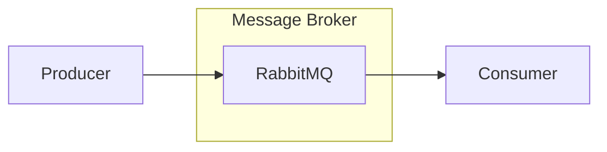
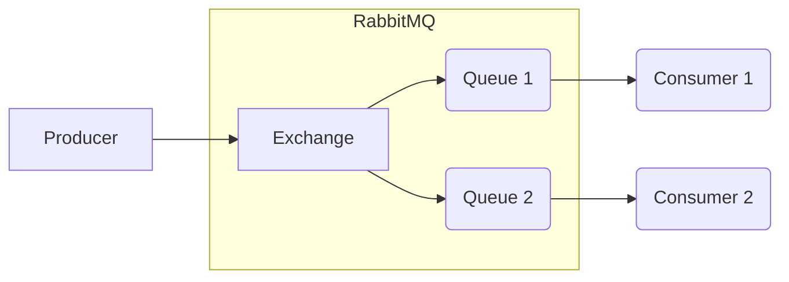

Nos ultimos anos tenho utilizado muito RabbitMQ para comunicação assincrona e utilização de filas, apesar de não ser um conceito novo tem se popularizado muito ultimamente.

RabbitMQ é um Message Broker, Message Brokers são meios de comunicação entre aplicações que redirecionam as mensagens para os serviços que irão consumir as mesmas, no caso do Rabbit utilizando filas, que é igual a fila da padaria, o primeiro a entrar é o primeiro a sair da fila.

Para isso, temos um Produtor (producer) das mensagens que vão para a fila (queue) e um consumidor (consumer) das mensagens, eles não necessitam ser da mesma linguagem nem mesmo se conhecerem, podem exisitr varios produtores da mesma mensagem como varios consumidores da mesma mensagem.

Para facilitar o envio de mensagens para diversas filas, que podem ter consumers distintos para as mesmas mensagens, no RabbitMQ temos as Exchanges, então ao inves de um producer enviar dados diretamente para a fila ele envia para um exchange que faz o roteamento para as devidas Queues configuradas e prontas para serem consumidas.

Claro que isso começa a confundir um pouco e porque eu iria querer fazer isso? Bom, imagina que você tem um e-commerce, e quando um pedido foi separado e está pronto para ser enviado você precisa notificar o cliente o status do pedido dele e a empresa transportadora para ir buscar aquele pedido, com uma exchange o seu producer pode enviar uma unica mensagem de “Pedido pronto para envio” que será redirecionado pelo RabbitMQ para 2 filas, exatamente a mesma mensagem, mas consumer com sua propria fila, irá tratar essa mensagem de maneira diferente, fazendo assim que 1 mensagem só seja enviada mas que tenha 2 processamentos distintos que não impactam um ao outro.

Você consegue fazer 2 consumers distintos consumirem a mesma fila e fazerem processamentos diferentes mas não aconselho muito isso pois você começa a se confundir quem ja consumiu a mensagem e não é uma boa pratica no RabbitMQ.

Então a mensagem caindo na nossa fila, o RabbitMQ vai enviar essa mensagem para 1 dos consumers que estiver conectada a ela e colocar o “status” dessa mensagem como “Unacked”, o que diz que essa mensagem já está sendo consumida por alguem, quando o consumer der um OK para o RabbitMQ que ja consumiu a mensagem com sucesso, ela é retirada da fila, em caso de falha o Consumer retorna para o RabbitMQ falando que ela mensagem não foi processada e o RabbitMQ tenta reenviar para algum consumer novamente. Esse é o comportamento padrão do RabbitMQ, podendo ter diversas configurações sendo feitas tanto no consumer quanto na Queue ou Exchange para tratar diferente.
Beleza, na teoria é tudo lindo, mas como fazemos isso na pratica?

Vou subir um RabbitMQ no docker com parte visual para ficar mais simples de trabalharmos:


docker run -p 15672:15672 -p 5672:5672 rabbitmq:3.8-management


Se quiser saber mais sobre docker, tem um [POST](/2021/09/27/docker-compose-vs.html) que eu escrevi que pode ajudar

Feito isso, abro meu navegador e vou para http://localhost:15672 e faço o login com o Usuário guest e a senha guest

Com isso ja temos nosso RabbitMQ rodando e podemos criar nossa Queue, acessando o menu superior Queue e temos no fim da pagina uma tab de “Add a new Queue” onde vou criar a Fila1 e a Fila 2, sem se preocupar muito com configurações seguindo o padrão que já está lá.

Podemos criar uma exchange para enviar mensagens para nossas filas, para isso vamos no menu Exchange e seguir o mesmo processo e criarmos a Exchange1.

Mas nossa exchange não está enviando as mensagens para nossas filas ainda, para isso precisamos criar os Bindings entre elas, então clicamos na nossa Exchange1 e vamos na tab “Bindings” e adicionamos com as nossas filas.

Agora se abrirmos a Tab de “Publish Message” podemos publicar uma mensagem na fila diretamente pelo Management do RabbitMQ que será redirecionada para as filas que fizemos os Bindings.

As mensagens podem ser qualquer coisa, já que quem serializa e deserializa ela são os producers e consumers mas o mais comum é enviar JSON, mas pode ser enviado protobuf por exemplo que faz a mensagem ficar menor ainda mas falo mais disso AQUI *Adicionar link do post* 

Vou publicar a seguinte mensagem:


{
“Message”: “Hello World!”
}


E se acessarmos nossas filas poderemos ver no gráfico que a mensagem está lá

E podemos até mesmo ver a mensagem na Tab “Get Messages”

Mas é claro que você não vai ficar fazendo isso na mão, no proximo post vou explicar como podemos fazer toda essa criação, publicação e consumir essas mensagens com .NET 😊